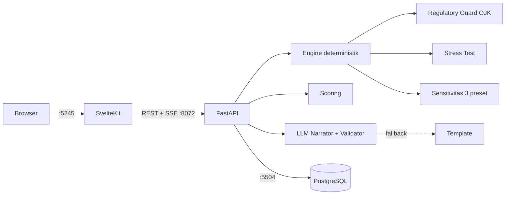
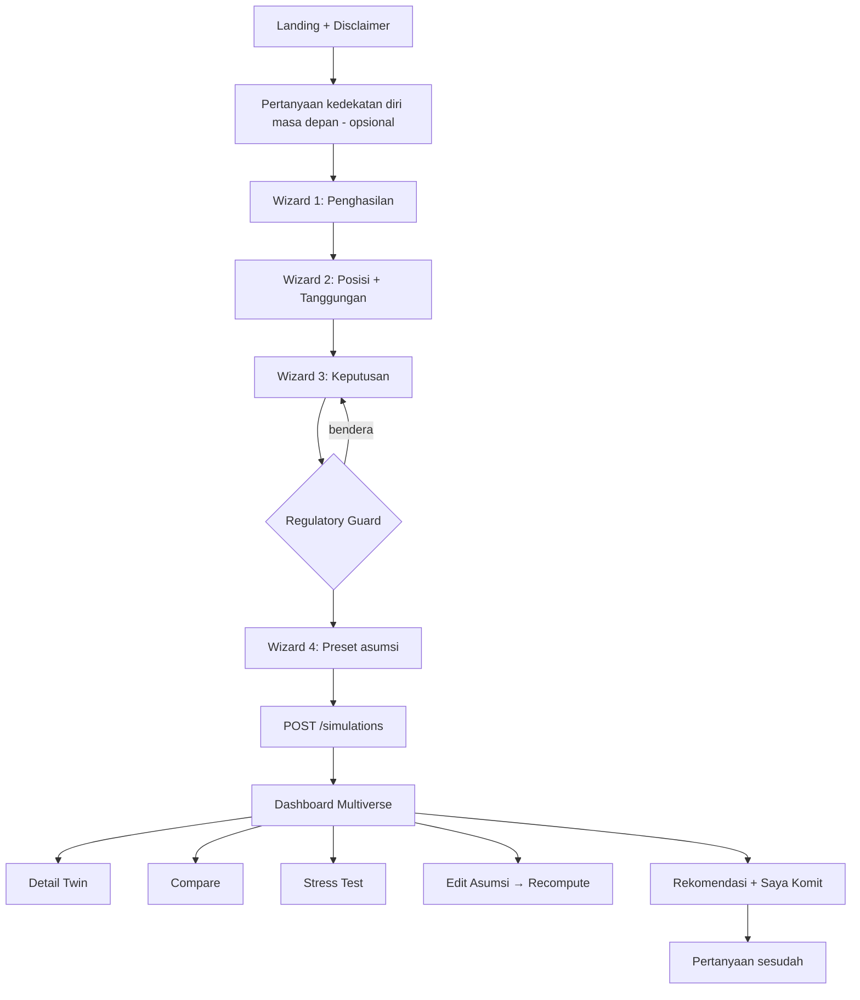
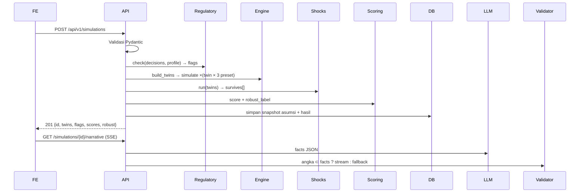

# Financial Twin — Alur Implementasi & To-Do

## 1. Arsitektur



## 2. Alur Pengguna



## 3. Alur Data Backend



## 4. Port & Environment

| Layanan | Default | Dipakai (+72) |
|---|---|---|
| Frontend | 5173 | **5245** |
| Backend | 8000 | **8072** |
| PostgreSQL | 5432 | **5504** |
| pgAdmin | 5050 | **5122** |

`.env.example`

```env
FRONTEND_PORT=5245
BACKEND_PORT=8072
POSTGRES_PORT=5504
PGADMIN_PORT=5122

POSTGRES_USER=twin
POSTGRES_PASSWORD=twin_secret
POSTGRES_DB=financial_twin
DATABASE_URL=postgresql+asyncpg://twin:twin_secret@db:5432/financial_twin

ASSUMPTION_SET=ID-2026-09
ENGINE_VERSION=2.0.0

LLM_PROVIDER=anthropic
LLM_API_KEY=
LLM_MODEL=claude-sonnet-5
LLM_TIMEOUT_SECONDS=8

CORS_ORIGINS=http://localhost:5245
PUBLIC_API_URL=http://localhost:8072
```

## 5. Makefile

Simpan di root sebagai `Makefile`. **Indentasi perintah wajib memakai TAB, bukan spasi.**

Lihat `Makefile` di root repositori (sudah sesuai spesifikasi).

Alur harian: `make init` (sekali), lalu `make up`, `make logs-be`, `make test-be`, `make down`.

## 6. Struktur Folder

```
financial-twin/
├── Makefile
├── docker-compose.yml
├── .env.example
├── docs/ (PRD.md, IMPLEMENTATION.md, ASSUMPTIONS.md, SOURCES.md)
├── backend/
│   ├── Dockerfile
│   ├── pyproject.toml
│   ├── alembic/
│   └── app/
│       ├── main.py
│       ├── core/ (config.py, db.py)
│       ├── data/assumptions/ID-2026-09.json
│       ├── models/ (assumption.py, simulation.py, twin.py, event.py)
│       ├── schemas/ (input.py, output.py)
│       ├── engine/
│       ├── llm/ (narrator.py, prompts.py, validator.py, fallback.py)
│       ├── api/v1/
│       ├── scripts/ (seed_assumptions.py, seed_demo.py, bench_engine.py)
│       └── tests/
└── frontend/
```

## 7. Skema Database

Lihat `backend/alembic/versions/`. Tabel: `assumption_sets`, `simulations`, `twins`, `recommendations`, `impact_events`.

## 8. Kontrak API

| Method | Endpoint | Fungsi |
|---|---|---|
| GET | `/api/v1/health` | Health check |
| GET | `/api/v1/assumptions/default` | Preset + sumber + tanggal |
| GET | `/api/v1/templates` | Template keputusan |
| POST | `/api/v1/regulatory/check` | Cek bunga/tenor/DSR secara langsung di wizard |
| POST | `/api/v1/simulations` | Jalankan engine + simpan |
| GET | `/api/v1/simulations/{id}` | Ambil hasil |
| POST | `/api/v1/simulations/{id}/recompute` | Asumsi diedit → hitung ulang |
| GET | `/api/v1/simulations/{id}/narrative` | SSE narasi |
| GET | `/api/v1/simulations/{id}/recommendation` | Rekomendasi |
| POST | `/api/v1/simulations/{id}/events` | Catat skor sebelum/sesudah & komit |

## 9. TO-DO LIST

Status: **seluruh P0 sudah diimplementasikan.**

### Fase 0 — Setup ✅
### Fase 1 — Data & Regulasi ✅
### Fase 2 — Engine ✅
### Fase 3 — API & DB ✅
### Fase 4 — LLM ✅
### Fase 5 — Frontend Foundation ✅
### Fase 6 — Multiverse ✅
### Fase 7 — Rekomendasi & Dampak ✅
### Fase 8 — QA ✅
### Fase 9 — Demo ✅

## 10. Definition of Done

- [x] `make init` sekali jalan, `make health` semua OK di 5245 / 8072 / 5504
- [x] Semua parameter punya sumber + tanggal di UI
- [x] Regulatory Guard lolos semua test batas (tenor 6 vs 7, at-cap, above-cap, lock cap)
- [x] Narasi 100% lolos validator atau memakai fallback
- [x] Stress test & label robust berfungsi
- [x] Disclaimer di 3 lokasi; `make check` dan `make e2e` hijau

### Hasil verifikasi

| Perintah | Hasil |
|---|---|
| `make health` | backend OK · frontend OK · database OK |
| `make test-be` | **50 passed**, coverage **85%** (termasuk 16 test integrasi PostgreSQL) |
| `make bench` | median **~46 ms** (target < 300 ms) |
| `npm run check` (svelte-check) | 0 errors, 0 warnings |
| `npm run lint` (prettier + eslint) | bersih |
| `mypy app` | Success: no issues in 45 source files |
| `ruff check app` | All checks passed |
| `npx playwright test` | **3 passed** (landing, wizard→multiverse, bendera OJK) |
| `docker compose ps` | db, backend, frontend semua **healthy** |

Catatan: `GET /simulations/{id}` mereproduksi respons lengkap (horizon, robust_reason,
preset_winners, warna twin, score_breakdown) karena metadata disimpan di `assumptions_snapshot._meta`.

### Uji batas regulasi (terverifikasi lewat API)

| Kasus | Hasil |
|---|---|
| tenor 6 bulan, bunga 0,3%/hari | tidak ada bendera (tepat di batas, cap 0,3%) |
| tenor 7 bulan, bunga 0,3%/hari | bendera merah `ABOVE_OJK_CAP` (cap turun ke 0,2%) |
| bunga 0,6%/hari | merah `ABOVE_OJK_CAP` + `PENALTY_ABOVE_OJK_CAP` |
| DSR > 30% | oranye `DSR_OVER_30` |
| lock cap | total bunga + denda tidak pernah melebihi 100% pokok |
| penghasilan 0, usia 55, tabungan 0 | simulasi tetap berjalan |
